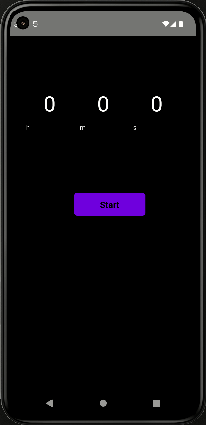

# VKountdown Timer

On this project I intended to create a simple countdown timer to help on daily tasks by managing time and keeping users aware of time speeding.
Since it's a simple application, there was no reason for using any framework.


## Running Locally

Clone the project

```bash
  git clone git@github.com:Vincenzofdg/VKountdown_Timer.git
```

Navigate to the project directory

```bash
  cd VKountdown_Timer 
```

Install dependencies

```bash
  npm install
```

Start the server

```bash
  npm run start
```

## Preview



## Dependencies

- [Native CountDown Component](https://github.com/talalmajali/react-native-countdown-component)
- [React Native Sound](https://github.com/zmxv/react-native-sound)
- [React Native Restart](https://github.com/avishayil/react-native-restart)
